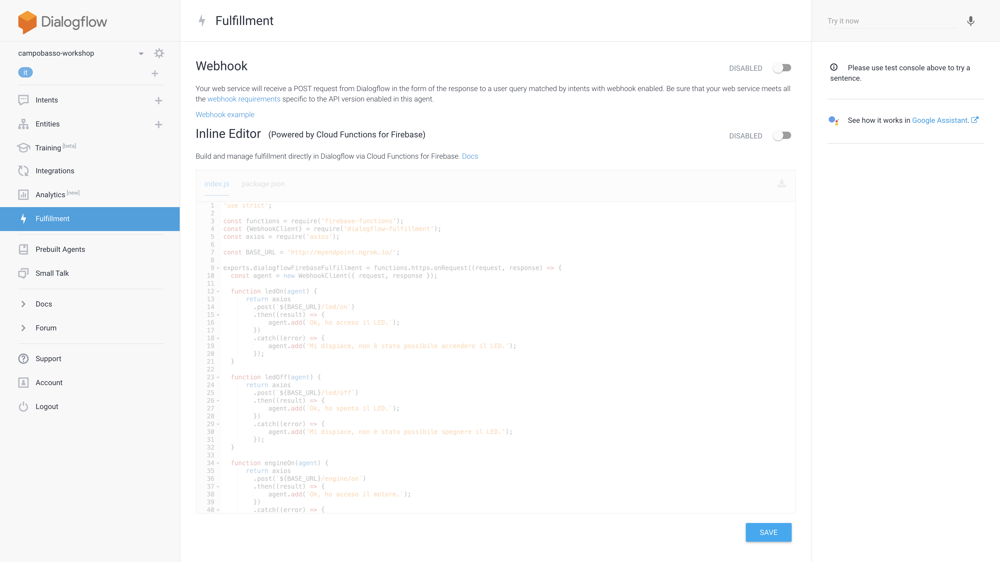

# Elaborazione comandi su Firebase

Nel secondo passo del tutorial imparerai a realizzare un semplice fulfillment
per Actions on Google, utilizzando l'editor integrato in Dialogflow.

## Abilitazione fulfillment

Sebbene abbiamo già abilitato il fulfillment per ogni Intent creato, ci serve
ora indicare, a livello di progetto, quale sarà il servizio Web che risponderà
alle richieste che provengono da Dialogflow.

Nella barra laterale sinistra, clicca su Fulfillment, ti si presenterà la
seguente schermata:



Abilita la seconda opzione, "Inline Editor". Questo ti
permetterà di scrivere la funzione di fulfillment direttamente nel browser,
senza dover installare alcun software sulla tua macchina.

## Scrittura codice di Fulfillment

Per completare il tutorial nel modo più veloce, puoi copiare e incollare il
codice disponibile in [questo repository](../functions) nelle due schede che hai
appena abilitato.

Assicurati di aver copiato il contenuto di entrambi i file, `index.js` e
`package.json` nelle due relative schede.

### Cloud Functions

Firebase Cloud Functions è un servizio di Firebase che ti permette di gestire
richieste Web in maniera semplice e veloce. La nostra implementazione utilizza
Javascript come linguaggio.

Il funzionamento delle Cloud Functions è basato sull'esportazione di una
funzione, nel nostro caso chiamata `dialogflowFirebaseFulfillment` che prende
in input un oggetto richiesta, `request`, e un oggetto di risposta (da
avvalorare), `response`.

La logica personalizzata può quindi leggere la richiesta, estrarre gli opportuni
parametri, e rispondere in qualsiasi modo si ritiene opportuno.

### Dialogflow Fulfillment

La libreria `dialogflow-fulfillment` (che come puoi notare è presente nelle
dipendenze nel file `package.json`) è l'ultima versione, in beta, dell'insieme
di utiities che permettono di leggere la richiesta `request` proveniente
da Dialogflow (e quindi dal tuo Google Home) ed inoltrare una risposta
`response` che verrà interpretata dal tuo Google Home, producendo l'integrazione
che desideriamo (nel nostro caso, una semplice risposta audio).

La parte centrale della libreria è la logica di "intent mapping":

```javascript
let intentMap = new Map();
intentMap.set('Accendi LED', ledOn);
intentMap.set('Spegni LED', ledOff);
intentMap.set('Accendi Motore', ledOn);
intentMap.set('Spegni Motore', ledOff);
agent.handleRequest(intentMap);
```

Nel codice incollato nell'editor online, abbiamo creato una mappa con:

* chiave: il nome dell'azione su Dialogflow
* valore: una funzione, locale alla Cloud Function, che serve a gestire la
particolare azione

In questo modo riusciamo a disaccoppiare facilmente la gestione di ogni azione
in una funzione separata.

Se vuoi, puoi leggere l'implementazione delle funzioni `ledOn`, `ledOff`,
`engineOn`, `engineOff` per capire come avviene l'interazione con il Raspberry
Pi e con il tuo Google Home. In sostanza, ogni funzione:

1. Chiama un servizio Web sul tuo Raspberry Pi, che va ad eseguire l'operazione
specifica (realizzerai il servizio Web al prossimo passo del tutorial).
2. Se l'operazione sul Raspberry Pi è andata a buon fine, la funzione utilizza
il metodo `agent.add` per comunicare all'utente - tramite audio su Google Home -
che l'azione è andata a buon fine.
3. Se l'operazione non è andata a buon fine, lo stesso metodo viene utilizzato
per comunicare un errore.

### Utilizzo di Promise

Le Promise sono una specifica di Javascript per gestire codice asincrono in
maniera più semplice rispetto alle callback.

I metodi che restituiscono una Promise possono essere concatenati tramite:
* `then`, per specificare cosa fare *dopo* che l'operazione asincrona ha
completato con successo
* `catch`, per specificare cosa fare in caso l'operazione asincrona ha fallito

Se vuoi avere più informazioni sulle Promise, puoi leggere
[questo articolo](https://developers.google.com/web/fundamentals/primers/promises).

## Deploy del fulfillment

A questo punto, clicca semplicemente sul pulsante "Deploy" e attendi il
messaggio di successo.

Congratulazioni!

Hai completato anche questo passo! Clicca [qui](03-raspberry.md) per imparare
come collegare la Cloud Function che hai appena creato al tuo Raspberry Pi.
