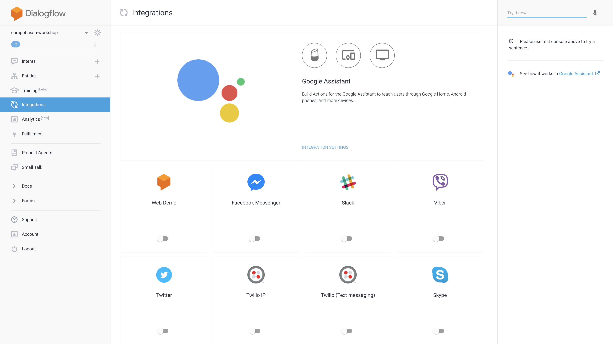
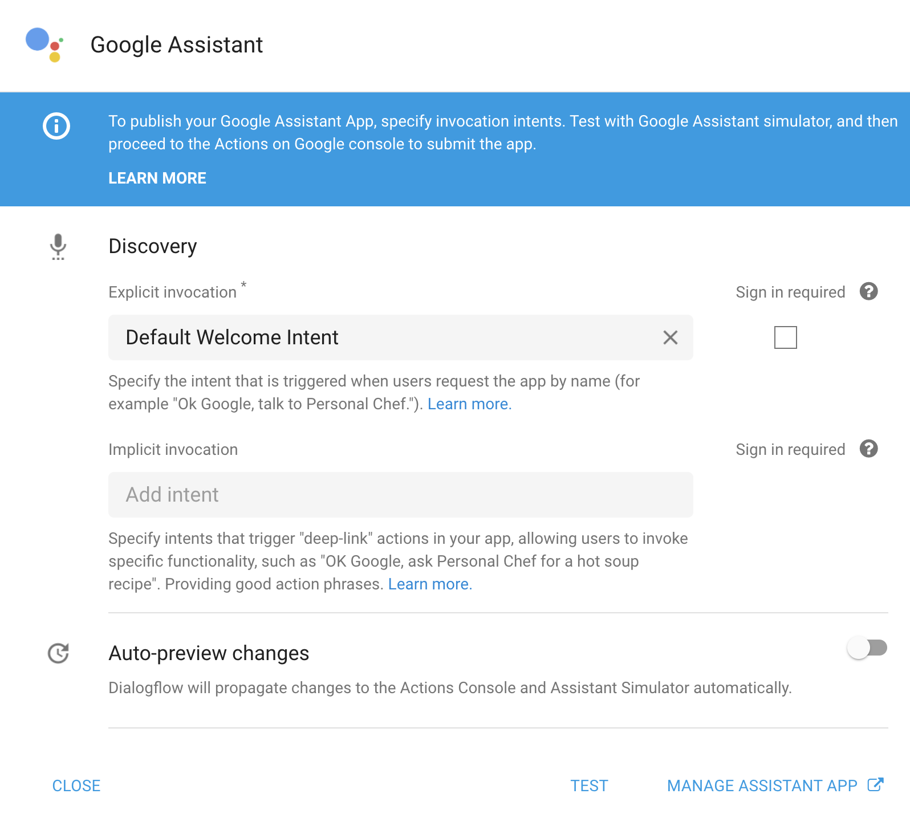
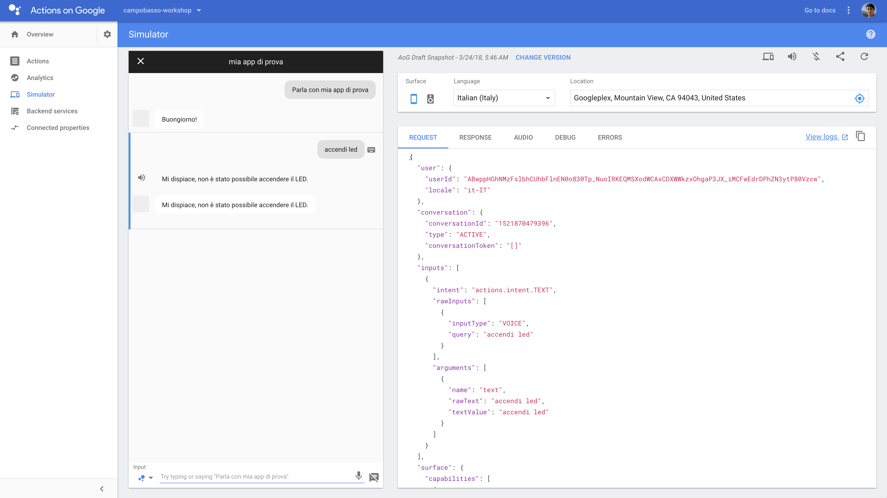

# Interfacciamento con LED e motore su Raspberry Pi

In questo passo del tutorial, dovrai scrivere una mini-applicazione Web che, sul
tuo Raspberry Pi, possa ricevere le chiamate effettuate dalla Cloud Function.

## Utilizzo di ngrok

Poiché ogni Raspberry Pi deve essere pubblicamente accessibile su Internet,
devi lanciare l'eseguibile `ngrok` sul tuo Raspberry Pi:

```bash
ngrok http 80
```

Se non hai `ngrok` installato sul Raspberry, puoi scaricarlo dal
[sito ufficiale](https://ngrok.com/download).

## Configurazione Cloud function

Una volta lanciato `ngrok`, visualizzerai un output sulla riga di comando con
l'indirizzo pubblico assegnato al tuon Raspberry Pi (esempio:
`https://abcdefgh.ngrok.io`).

Copia questo indirizzo e sostituiscilo alla `BASE_URL` nella Cloud Function.

## Web server e gestione hardware

Per la gestione dell'hardware (LED e motore) puoi utilizzare il linguaggio di
programmazione che preferisci. Dovrai realizzare un servizio Web che risponda a
richieste `POST` ai seguenti indirizzi:

* `led/on` per accendere il LED
* `led/off` per spegnere il LED
* `engine/on` per accendere il motore
* `engine/off` per spegnere il motore

Se vuoi scrivere il tuo Web server in Python, puoi utilizzare
[SimpleHTTPServer](https://docs.python.org/2/library/simplehttpserver.html) per
una semplice implementazione.

## Test dell'integrazione

Hai quasi terminato! Non ti resta che testare l'integrazione da Dialogflow: usa
la barra laterale destra per digitare il testo che vuoi venga analizzato (o
premi il pulsante del microfono per parlare), quindi premi invio!

Il testo verrà analizzato da Dialogflow, che invocherà la tua funzione su
Firebase. A sua volta, la funzione invocherà il server Web sul Raspberry Pi,
che potrà gestire opportunamente la richiesta!

## Abilitazione Actions on Google

Congratulazioni! Hai completato questo tutorial!

Se vuoi, non ti resta che eseguire il deploy dell'azione su "Actions on Google".
Da Dialogflow, vai nella sezione "Integrations":



Clicca su "Integrartion settings", ti si presenterà la seguente schermata:



Cliccando su "Test" e procedendo, verrai reindirizzato al simulatore di Actions
on Google, dal quale potrai facilmente testare la tua azione!



## Nome dell'azione

Nel simulatore, l'azione ha il nome di default "la mia app di prova". Clicca su
"Overview" e configura i dati della tua azione, includendo il nome di
invocazione e altri parametri richiesti.

Questo ti permetterà di aprire l'azione con un nome più significativo:

> Ok Google, fammi parlare con Motore Azione

## Test su Google Home

Per testare l'applicazione su Google Home (o sul tuo smartphone con Google
Assistant), devi inserire tutte le informazioni obbligatorie nella sezione
"Overview" del simulatore.

Una volta inserito tutti i dati richiesti, accertati di avere eseguito il login,
sul tuo smartphone o Google Home, con lo stesso account che hai utilizzato per
sviluppare l'azione.

Quindi, invoca il nome dell'applicazione:

> Ok Google, fammi parlare con Motore Azione

A questo punto, puoi invocare uno dei comandi che abbiamo sviluppato!
